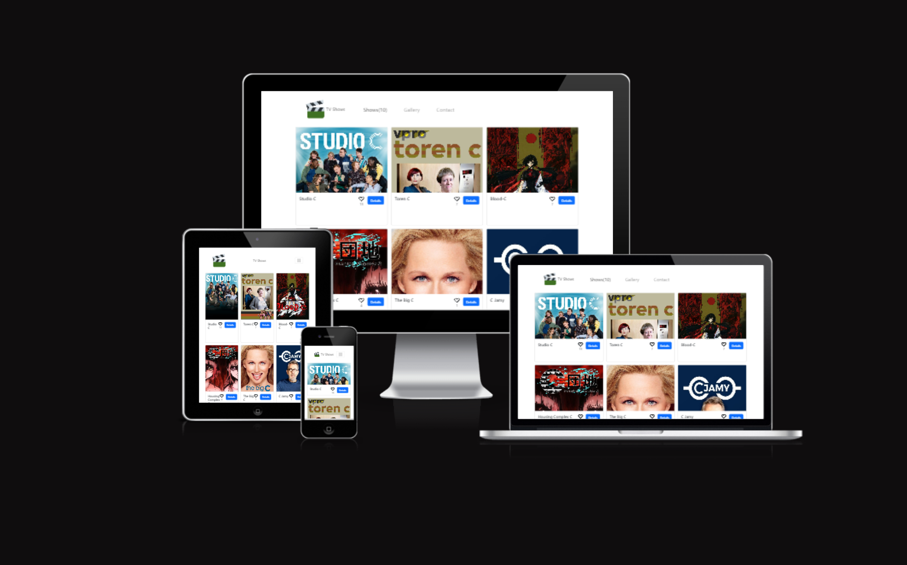

# Capstone-II

# Tvmaze
This JavaScript capstone project is built on the [TVMAZE API](https://www.tvmaze.com/api), an external API, and Microverse's in-house [Involvement API](https://www.notion.so/microverse/Involvement-API-869e60b5ad104603aa6db59e08150270). The cards display the tv show information that was fetched from the API and stores comments and likes rated by users. The user has the option to see details like and comment on the show cards.

## Built With
- HTML5, CSS3 and JavaScript, and API
- Webpack
- Linters
  - Stylelint, Lighthouse, Webhint and ESLint
- GitHub Pages
- GitFlow 

## Project Documentation

## Website Mockup 📱 💻 🖥️

  
## Live Demo 
Now it is available  [TVMAZE](https://jfoyarzo.github.io/Capstone-II/)
## Getting Started
To get a local copy up run the following steps.

## Prerequisites
- Node.js
- Git
- Web Browser
- Vscode(optional)

## Setup
- Clone the repository to your local machine using `git clone` command.
- `npm i` to install all the dependencies
- `npm run` build to build the project
- `npm start` to start the server

## Run tests
- `npm run test` to run the tests
## Authors

👤 **Felipe Oyarazo**
- GitHub: [@jfoyarzo](https://github.com/jfoyarzo)
- Twitter: [@jfoyarzo](https://twitter.com/jfoyarzo)
- LinkedIn: [@jfoyarzo](https://www.linkedin.com/in/jorge-felipe-oyarzo-contreras-647118247/)

👤 **Miliyon Ayalew**

- GitHub: [@Miliyonayalew](https://github.com/Miliyonayalew/)
- Twitter: [@MilaAyalew](https://twitter.com/MilaAyalew)
- LinkedIn: [@miliyon-ayalew](https://www.linkedin.com/in/miliyon-ayalew-210808131/)

## 🤝 Contributing

Contributions, issues, and feature requests are welcome!

Feel free to check the [issues page](../../issues/).

## Show your support

Give a ⭐️ if you like this project!

## Acknowledgments

- Inspiration 
- TVMAZE API

## 📝 License

This project is [MIT](./LICENSE) licensed.
